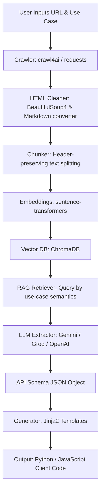

# 🛠️ Smart DevTool for API

Smart DevTool is a modern web application and backend engine designed to automatically crawl raw API documentation pages, parse and clean their contents, build a local vector database index (RAG), and use LLMs to extract clean endpoint schemas and generate production-grade client wrappers (SDKs) in Python and JavaScript.

---

## 🌟 Key Features

- **🌐 Deep Documentation Crawling**: Recursively crawls unstructured HTML/Markdown docs up to specified depths.
- **🧹 Precision Content Cleaner**: Strips page boilerplate (headers, footers, sidebars, navigation bars) to extract core code blocks, schemas, parameters, and routes.
- **🧠 Semantic RAG Pipeline**:
  - Automatically splits documents using a header-preserving markdown chunker.
  - Converts text into vector embeddings using `sentence-transformers` locally.
  - Stores and indexes chunks in a local **ChromaDB** instance.
- **🤖 LLM Schema Extractor**: 
  - Works with multiple providers: **Gemini (Google)**, **Groq**, and **OpenAI**.
  - Features self-repairing JSON parsing logic to extract precise endpoints, parameters, descriptions, and authentication requirements.
- **⚡ Dynamic Client Code Generation**: 
  - Generates ready-to-run wrappers using Jinja2 templates.
  - Generates Python (using `requests`) and JavaScript/Node.js (using `axios`).
- **💬 Interactive Chat Assistant**: Features a side-by-side AI chat panel contextually aware of the API schema to help developers debug or explore integration strategies.
- **🎨 Warm Sage & Neutral Glassmorphic UI**: Beautiful, fully responsive modern front-end featuring tabbed code/schema views and real-time execution step feedback.

---

## 📐 System Architecture

The following diagram illustrates the flow of data from raw web pages to the final generated SDK wrapper:



---

## 📁 Repository Structure

```
smart-devtool-for-api/
│
├── backend/            # FastAPI Web API
│   ├── main.py         # Application entrypoint & lifespan
│   └── routes.py       # API routes (crawl, generate, status, chat)
│
├── crawler/            # Web scraping & crawling module
│   └── crawler.py      # Multi-page recursion & scraping logic
│
├── parser/             # Content cleaning & structure normalization
│   └── cleaner.py      # Boilerplate remover & Markdown renderer
│
├── rag/                # Retrieval-Augmented Generation module
│   ├── chunker.py      # Header-aware document chunking
│   ├── embeddings.py   # Embedding generator (local/remote)
│   └── retriever.py    # ChromaDB indexing & vector queries
│
├── llm/                # LLM connectors and prompt engineering
│   ├── extractor.py    # Schema parser & structure extractor
│   └── chatbot.py      # RAG-aware chatbot backend
│
├── generator/          # Code generation engine
│   └── wrapper_generator.py # Jinja2 code rendering logic
│
├── templates/          # Jinja templates for code wrappers
│   ├── python.j2       # Python Client class template
│   └── javascript.j2   # JavaScript Client class template
│
├── static/             # Frontend assets
│   ├── app.js          # Interactive UI driver
│   └── styles.css      # Warm Neutral CSS styling & Prism overrides
│
├── frontend/           # Web app files
│   └── index.html      # Main application markup
│
├── tests/              # Test suite
│   ├── test_pipeline.py # Integration pipeline tests
│   └── test_chatbot.py  # Chatbot functionality tests
│
├── pyproject.toml      # Dependency & package configuration
├── .env.example        # Environment variable template
└── README.md           # Documentation
```

---

## ⚙️ Setup and Installation

### Prerequisites

- Python `>=3.10`
- API Key from one of the supported providers:
  - **Groq** (Recommended default: Fast & cost-effective)
  - **Gemini** (Google AI Studio)
  - **OpenAI**

### Step 1: Clone the Repository

```bash
git clone https://github.com/your-username/smart-devtool-for-api.git
cd smart-devtool-for-api
```

### Step 2: Install Python dependencies

We recommend using **`uv`** for lightning-fast environment setup, but standard `pip` works perfectly:

#### Option A: Using `uv` (Recommended)
```bash
# Setup virtual environment and install all packages
uv sync
```

#### Option B: Using standard Python `venv` & `pip`
```bash
# Create a virtual environment
python -m venv .venv

# Activate the environment
# On Windows (PowerShell):
.venv\Scripts\Activate.ps1
# On Windows (cmd):
.venv\Scripts\activate.bat
# On macOS/Linux:
source .venv/bin/activate

# Install dependencies in editable mode
pip install -e .
```

### Step 3: Configure Environment Variables

1. Copy the example environment file:
   ```bash
   cp .env.example .env
   ```
2. Open `.env` and fill in your keys and settings:
   ```env
   # API Keys
   LLM_PROVIDER=groq
   GROQ_API_KEY=your_groq_api_key_here
   GROQ_MODEL=llama-3.1-8b-instant

   # Server Config
   PORT=8000
   HOST=127.0.0.1
   ```

---

## 🚀 Running the Application

### Launch the server

Run the main execution script with the `--server` flag:

```bash
python main.py --server
```

Or run via `uv` / active environment:
```bash
# Using uv
uv run python main.py --server

# Direct uvicorn launch
uvicorn backend.main:app --host 127.0.0.1 --port 8000 --reload
```

Once running, navigate to `http://127.0.0.1:8000/` in your browser.

---

## 🕹️ How to Use

1. **Provide API Docs**: Enter the documentation URL of the target API (e.g., `https://platform.openai.com/docs/api-reference`) in the **Documentation URL** field.
2. **Describe Your Use Case**: Briefly describe what you're trying to build (e.g. *"Create client wrapper to send message threads and retrieve replies"*).
3. **Select Language**: Choose Python or JavaScript.
4. **Generate**: Click **Generate Wrapper Client**. Watch the sidebar steps transition from crawling ➡️ parsing ➡️ vector-indexing ➡️ wrapper-generation.
5. **Inspect & Download**:
   - Inspect the generated wrapper under the **Generated Client Code** tab (fully syntax-highlighted).
   - Click **Download File** to save it locally.
   - View the extracted schema variables under the **Extracted API Schema** tab.
6. **Chat Assistant**: Ask any additional questions about the API or integration directly using the chat panel on the right!

---

## 🧪 Running Tests

To verify that the crawler, vector db, parser, chatbot, and generators perform correctly, run the test suite:

```bash
# Using uv
uv run pytest

# Or standard pytest
pytest
```
